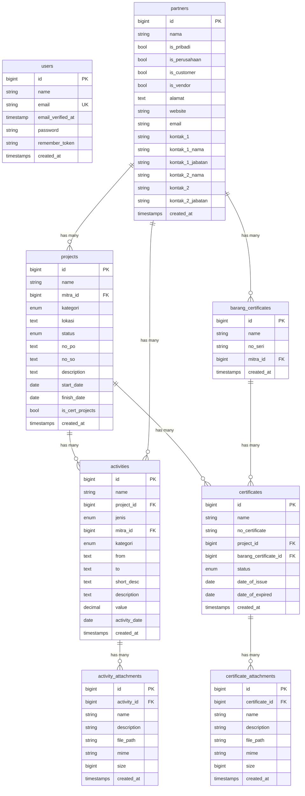

# 🗄️ Database Structure (Konseptual)

> Dokumentasi skema tabel inti dan relasi database untuk aplikasi Project Management.

---

## 📊 Diagram Relasi (ERD)

---

## 📋 Skema Tabel Detail

### 1. `users` — Tabel Pengguna

| Kolom | Tipe Data | Constraint | Keterangan |
|-------|-----------|------------|------------|
| `id` | `BIGINT` | PK, Auto increment | ID unik pengguna |
| `name` | `VARCHAR(255)` | NOT NULL | Nama lengkap |
| `email` | `VARCHAR(255)` | UNIQUE, NOT NULL | Email (dipakai untuk login) |
| `email_verified_at` | `TIMESTAMP` | NULLABLE | Waktu verifikasi email |
| `password` | `VARCHAR(255)` | NOT NULL | Password (hashed via `bcrypt`) |
| `remember_token` | `VARCHAR(100)` | NULLABLE | Token "Remember Me" |
| `created_at` | `TIMESTAMP` | — | Waktu dibuat |
| `updated_at` | `TIMESTAMP` | — | Waktu terakhir diupdate |

> [!NOTE]
> Tabel `users` terintegrasi dengan **Spatie Permission** melalui tabel pivot `model_has_roles` dan `model_has_permissions` untuk manajemen role (super_admin, admin, user, finance, dll).

---

### 2. `partners` — Tabel Mitra (Customer / Vendor)

> Model Eloquent: `Mitra` (mapping: `protected $table = 'partners'`)

| Kolom | Tipe Data | Constraint | Keterangan |
|-------|-----------|------------|------------|
| `id` | `BIGINT` | PK | ID unik mitra |
| `nama` | `VARCHAR(255)` | NOT NULL | Nama mitra/perusahaan |
| `is_pribadi` | `BOOLEAN` | DEFAULT `false` | Apakah mitra perorangan |
| `is_perusahaan` | `BOOLEAN` | DEFAULT `false` | Apakah mitra perusahaan |
| `is_customer` | `BOOLEAN` | DEFAULT `false` | Apakah berperan sebagai customer |
| `is_vendor` | `BOOLEAN` | DEFAULT `false` | Apakah berperan sebagai vendor |
| `alamat` | `TEXT` | NOT NULL | Alamat lengkap |
| `website` | `VARCHAR(255)` | NULLABLE | URL website |
| `email` | `VARCHAR(255)` | NULLABLE | Email bisnis |
| `kontak_1` | `VARCHAR(255)` | NULLABLE | Nomor kontak utama |
| `kontak_1_nama` | `VARCHAR(255)` | NULLABLE | Nama PIC utama |
| `kontak_1_jabatan` | `VARCHAR(255)` | NULLABLE | Jabatan PIC utama |
| `kontak_2_nama` | `VARCHAR(255)` | NULLABLE | Nama PIC kedua |
| `kontak_2` | `VARCHAR(255)` | NULLABLE | Nomor kontak kedua |
| `kontak_2_jabatan` | `VARCHAR(255)` | NULLABLE | Jabatan PIC kedua |
| `created_at` | `TIMESTAMP` | — | Waktu dibuat |
| `updated_at` | `TIMESTAMP` | — | Waktu terakhir diupdate |

> [!IMPORTANT]
> Satu mitra bisa memiliki **beberapa peran sekaligus** (is_customer = true DAN is_vendor = true). Ini memungkinkan fleksibilitas tanpa duplikasi data mitra.

---

### 3. `projects` — Tabel Proyek

| Kolom | Tipe Data | Constraint | Keterangan |
|-------|-----------|------------|------------|
| `id` | `BIGINT` | PK | ID unik proyek |
| `name` | `VARCHAR(255)` | NOT NULL | Nama proyek |
| `mitra_id` | `BIGINT` | FK → `partners.id`, NULLABLE, ON DELETE SET NULL | Customer/mitra terkait |
| `kategori` | `ENUM` | NOT NULL, DEFAULT `'PLTS Hybrid'` | Kategori proyek |
| `lokasi` | `TEXT` | NULLABLE | Lokasi proyek |
| `status` | `ENUM` | NOT NULL, DEFAULT `'Ongoing'` | Status proyek |
| `no_po` | `TEXT` | NULLABLE | Nomor Purchase Order |
| `no_so` | `TEXT` | NULLABLE | Nomor Sales Order |
| `description` | `TEXT` | NOT NULL | Deskripsi proyek |
| `start_date` | `DATE` | NOT NULL | Tanggal mulai proyek |
| `finish_date` | `DATE` | NULLABLE | Tanggal selesai proyek |
| `is_cert_projects` | `BOOLEAN` | DEFAULT `false` | Apakah proyek sertifikasi |
| `created_at` | `TIMESTAMP` | — | Waktu dibuat |
| `updated_at` | `TIMESTAMP` | — | Waktu terakhir diupdate |

**Nilai `kategori`:**
| Value |
|-------|
| `PLTS Hybrid` |
| `PLTS Ongrid` |
| `PLTS Offgrid` |
| `PJUTS All In One` |
| `PJUTS Two In One` |
| `PJUTS Konvensional` |

**Nilai `status`:**
| Value | Keterangan |
|-------|------------|
| `Ongoing` | Proyek sedang berjalan |
| `Prospect` | Proyek prospek/rencana |
| `Complete` | Proyek selesai |
| `Cancel` | Proyek dibatalkan |

---

### 4. `activities` — Tabel Aktivitas

| Kolom | Tipe Data | Constraint | Keterangan |
|-------|-----------|------------|------------|
| `id` | `BIGINT` | PK | ID unik aktivitas |
| `name` | `VARCHAR(255)` | NOT NULL | Nama/judul aktivitas |
| `project_id` | `BIGINT` | FK → `projects.id`, ON DELETE CASCADE | Proyek pemilik |
| `jenis` | `ENUM` | NOT NULL, DEFAULT `'Internal'` | Jenis: `Internal`, `Customer`, `Vendor` |
| `mitra_id` | `BIGINT` | FK → `partners.id`, NULLABLE, ON DELETE SET NULL | Mitra terkait |
| `kategori` | `ENUM` | NOT NULL, DEFAULT `'Expense Report'` | Kategori dokumen (16 jenis) |
| `from` | `TEXT` | NULLABLE | Pengirim/asal dokumen |
| `to` | `TEXT` | NULLABLE | Penerima/tujuan dokumen |
| `short_desc` | `TEXT` | NULLABLE | Ringkasan singkat |
| `description` | `TEXT` | NOT NULL | Deskripsi lengkap |
| `value` | `DECIMAL(15,2)` | DEFAULT `0.00` | Nilai nominal (Rupiah) |
| `activity_date` | `DATE` | NOT NULL | Tanggal aktivitas |
| `created_at` | `TIMESTAMP` | — | Waktu dibuat |
| `updated_at` | `TIMESTAMP` | — | Waktu terakhir diupdate |

**Nilai `kategori` (16 jenis):**

| # | Value | # | Value |
|---|-------|---|-------|
| 1 | `Expense Report` | 9 | `Kasbon` |
| 2 | `Invoice` | 10 | `Laporan Teknis` |
| 3 | `Invoice & FP` | 11 | `Surat Masuk` |
| 4 | `Purchase Order` | 12 | `Surat Keluar` |
| 5 | `Payment` | 13 | `Kontrak` |
| 6 | `Quotation` | 14 | `Berita Acara` |
| 7 | `Faktur Pajak` | 15 | `Receive Item` |
| 8 | `Delivery Order` | 16 | `Legalitas` / `Other` |

---

### 5. `activity_attachments` — Tabel Lampiran Aktivitas

| Kolom | Tipe Data | Constraint | Keterangan |
|-------|-----------|------------|------------|
| `id` | `BIGINT` | PK | ID unik attachment |
| `activity_id` | `BIGINT` | FK → `activities.id`, ON DELETE CASCADE | Aktivitas pemilik |
| `name` | `VARCHAR(60)` | NOT NULL | Nama file yang ditampilkan |
| `description` | `VARCHAR(255)` | NOT NULL | Deskripsi file |
| `file_path` | `VARCHAR(255)` | NOT NULL | Path file di storage |
| `mime` | `VARCHAR(191)` | NULLABLE | MIME type file |
| `size` | `BIGINT UNSIGNED` | NULLABLE | Ukuran file (bytes) |
| `created_at` | `TIMESTAMP` | — | Waktu dibuat |
| `updated_at` | `TIMESTAMP` | — | Waktu terakhir diupdate |

---

### 6. `barang_certificates` — Tabel Barang Sertifikat

| Kolom | Tipe Data | Constraint | Keterangan |
|-------|-----------|------------|------------|
| `id` | `BIGINT` | PK | ID unik barang |
| `name` | `VARCHAR(255)` | NOT NULL | Nama barang |
| `no_seri` | `VARCHAR(30)` | NOT NULL | Nomor seri barang |
| `mitra_id` | `BIGINT` | FK → `partners.id`, NULLABLE, ON DELETE SET NULL | Vendor/mitra pemilik |
| `created_at` | `TIMESTAMP` | — | Waktu dibuat |
| `updated_at` | `TIMESTAMP` | — | Waktu terakhir diupdate |

---

### 7. `certificates` — Tabel Sertifikat

| Kolom | Tipe Data | Constraint | Keterangan |
|-------|-----------|------------|------------|
| `id` | `BIGINT` | PK | ID unik sertifikat |
| `name` | `VARCHAR(255)` | NOT NULL | Nama sertifikat |
| `no_certificate` | `VARCHAR(30)` | NOT NULL | Nomor sertifikat |
| `project_id` | `BIGINT` | FK → `projects.id`, NULLABLE, ON DELETE SET NULL | Proyek terkait |
| `barang_certificate_id` | `BIGINT` | FK → `barang_certificates.id`, NULLABLE, ON DELETE SET NULL | Barang bersertifikat |
| `status` | `ENUM` | DEFAULT `'Belum'` | Status: `Belum`, `Tidak Aktif`, `Aktif` |
| `date_of_issue` | `DATE` | NULLABLE | Tanggal terbit sertifikat |
| `date_of_expired` | `DATE` | NULLABLE | Tanggal kadaluarsa |
| `created_at` | `TIMESTAMP` | — | Waktu dibuat |
| `updated_at` | `TIMESTAMP` | — | Waktu terakhir diupdate |

---

### 8. `certificate_attachments` — Tabel Lampiran Sertifikat

| Kolom | Tipe Data | Constraint | Keterangan |
|-------|-----------|------------|------------|
| `id` | `BIGINT` | PK | ID unik attachment |
| `certificate_id` | `BIGINT` | FK → `certificates.id`, ON DELETE CASCADE | Sertifikat pemilik |
| `name` | `VARCHAR(60)` | NOT NULL | Nama file yang ditampilkan |
| `description` | `VARCHAR(255)` | NOT NULL | Deskripsi file |
| `file_path` | `VARCHAR(255)` | NOT NULL | Path file di storage |
| `mime` | `VARCHAR(191)` | NULLABLE | MIME type file |
| `size` | `BIGINT UNSIGNED` | NULLABLE | Ukuran file (bytes) |
| `created_at` | `TIMESTAMP` | — | Waktu dibuat |
| `updated_at` | `TIMESTAMP` | — | Waktu terakhir diupdate |

---

## 🔗 Ringkasan Relasi

| Relasi | Tipe | Penjelasan |
|--------|------|------------|
| `partners` → `projects` | **One-to-Many** | Satu mitra bisa memiliki banyak proyek |
| `projects` → `activities` | **One-to-Many** | Satu proyek memiliki banyak aktivitas |
| `partners` → `activities` | **One-to-Many** | Satu mitra bisa terlibat di banyak aktivitas |
| `activities` → `activity_attachments` | **One-to-Many** | Satu aktivitas bisa punya banyak lampiran |
| `partners` → `barang_certificates` | **One-to-Many** | Satu vendor bisa punya banyak barang bersertifikat |
| `projects` → `certificates` | **One-to-Many** | Satu proyek bisa punya banyak sertifikat |
| `barang_certificates` → `certificates` | **One-to-Many** | Satu barang bisa punya banyak sertifikat |
| `certificates` → `certificate_attachments` | **One-to-Many** | Satu sertifikat bisa punya banyak lampiran |

---

## 📦 Tabel Pendukung

Tabel-tabel berikut dikelola oleh Laravel/Spatie dan tidak perlu dimodifikasi secara manual:

| Tabel | Dikelola Oleh | Keterangan |
|-------|---------------|------------|
| `sessions` | Laravel | Session driver |
| `cache` | Laravel | Cache driver |
| `cache_locks` | Laravel | Cache locking |
| `jobs` | Laravel | Queue jobs |
| `job_batches` | Laravel | Batch jobs |
| `failed_jobs` | Laravel | Failed queue jobs |
| `password_reset_tokens` | Laravel | Reset password |
| `personal_access_tokens` | Laravel Sanctum | API tokens (cadangan) |
| `roles` | Spatie Permission | Definisi role |
| `permissions` | Spatie Permission | Definisi permission |
| `model_has_roles` | Spatie Permission | Pivot: user ↔ role |
| `model_has_permissions` | Spatie Permission | Pivot: user ↔ permission |
| `role_has_permissions` | Spatie Permission | Pivot: role ↔ permission |

---

## 📝 Catatan Arsitektural

> [!WARNING]
> **Naming Convention Campuran:** Tabel database menggunakan campuran Bahasa Indonesia (`nama`, `alamat`, `kategori`, `lokasi`) dan Bahasa Inggris (`name`, `status`, `description`). Ini adalah keputusan desain awal yang sudah embedded di seluruh codebase. Konsistenkan penamaan untuk tabel/kolom baru menggunakan Bahasa Inggris.

> [!NOTE]
> **Soft Delete tidak digunakan.** Penghapusan data bersifat hard delete. Activity Log (audit trail) via trait `LogsActivity` memastikan perubahan data tetap bisa dilacak walaupun data sudah dihapus.
